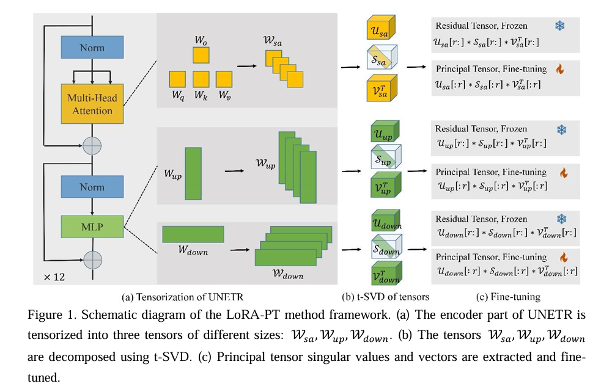

# LoRA-PT
LoRA-PT: Low-Rank Adapting UNETR for Hippocampus Segmentation Using Principal Tensor Singular Values and Vectors
[https://export.arxiv.org/abs/2407.11292](https://export.arxiv.org/abs/2407.11292)


# Contact
if you have any question about our project, please feel free to contact us by email at wgcheng0@gmail.com

# Environment install
Clone this repository and navigate to the root directory of the project.
```python
git clone https://github.com/WangangCheng/LoRA-PT.git
cd LoRA-PT
pip install -r requirements.txt
```
Note: Our cuda version is 12.4, You can install pytorch from this [link](https://pytorch.org/)

# Data downloading
You can download the pre-trained weights at this link, You can download the pre-trained weights from this link and put them in the `checkpoint/UNETR2024-05-23`.

Download our processed EADC data from Baidu Netdisk [link](https://pan.baidu.com/s/1-KMDTdK97rbxYJ8EdKggow?pwd=1111), Or you can also get the source data on the official website [EADC](http://adni.loni.usc.edu/)

